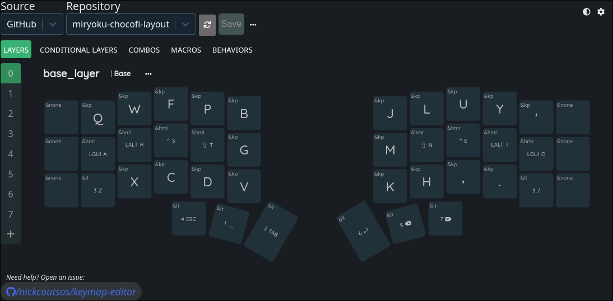

# Miryoku-Chocofi Layout

An ergonomic, minimal, and fully-featured keymap for the **Chocofi 36-key split keyboard** (RP2040).  
Built on the principles of [Miryoku](https://github.com/manna-harbour/miryoku) — efficiency, symmetry, and minimal finger movement.

---

## ✨ Features

- 🧠 **Miryoku principles:** use layers instead of reaches, home-row mods, mirrored thumbs
- 🎯 **6 Layers:** Base, Nav, Num, Sym, Fun, Mouse
- 🪄 **Combos & Macros:** for navigation, undo/redo, Esc, Enter, and more
- ⚡ **Behaviors:** dual-function thumbs (tap for key, hold for layer), conditional layers
- 🔋 Optimized for **wireless RP2040** builds with battery and display support
- 💻 Editable via [Keymap Editor](https://nickcoutsos.github.io/keymap-editor/)
- 🧩 Faithful Miryoku port for **ZMK** (not QMK), adapted for Chocofi

---

## 🤔 Why this repo exists

This repository provides a ready-to-use Miryoku layout for the Chocofi 36-key split keyboard, built on ZMK and fully compatible with the Keymap Editor.

It removes the need to manually adapt Miryoku’s QMK or ZMK templates and makes customization accessible through a visual editor, while staying 100% faithful to the original Miryoku philosophy and structure.

---

## 🧩 Layout Overview

**Base Layer (Colemak-DH)**  
Home-row mods on both hands; thumbs control layers and key functions.

---

## 🔧 Quick Start

1. **Fork this repo**
2. Open the Keymap Editor  
   https://nickcoutsos.github.io/keymap-editor/
3. Select your forked repo and branch
4. Customize your layout visually
5. Export your firmware and flash it to your Chocofi (wired or wireless)

---

## 🧠 Layers Included

| Layer | Function                         |
| ----- | -------------------------------- |
| Base  | Colemak-DH alphas, home-row mods |
| Nav   | Arrows, editing, shortcuts       |
| Num   | Numpad & symbols                 |
| Sym   | Punctuation, brackets, etc.      |
| Fun   | F-keys, system shortcuts         |
| Mouse | Cursor control & media           |

---

## 🔋 Wireless Notes

For builds using batteries and displays, follow the  
[Wireless Chocofi Guide](https://s.beekeeb.com/wcrguide)

---

## 📄 License

MIT License — free to remix, adapt, and share.

---

## 🧑‍💻 Credits

- [Pavel Glushkov](https://github.com/pavlukhin) – Chocofi Keyboard
- [Manna Harbour](https://github.com/manna-harbour/miryoku) – Miryoku Layout
- [Nick Coutsos](https://github.com/nickcoutsos/keymap-editor) – Keymap Editor
